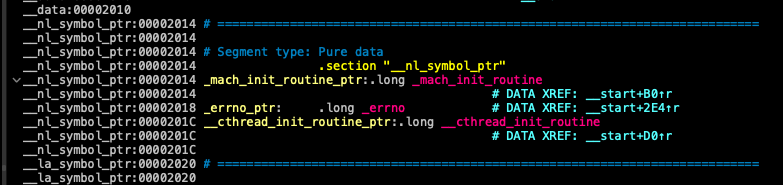
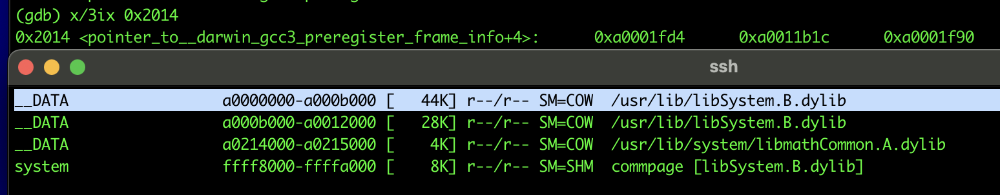
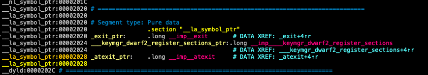
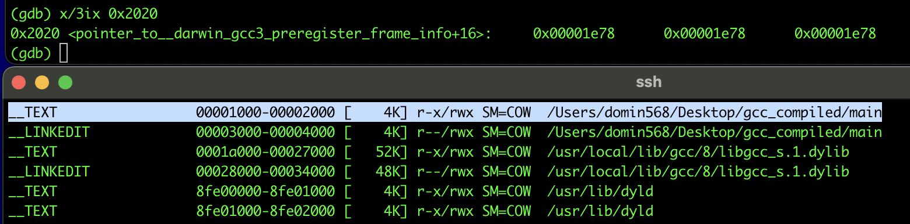

OsxPpcEmu

Project was instantiated to emulate some old PowerPC32 command line OSX programs. 
Linking is based on dyld 46.16 (from Mac OS X 10.4.11).
 
#Dyld notes

Almost each executable in Darwin (OSX) is linked dynamically, that means all needed functions are linked during binary load.
On Mac OS X (10.4) when MachO is executed, kernel (xnu/bsd/kern/mach_loader.c):
- maps segments (LC_COMMAND), 
- sets entry point (LC_UNIXTHREAD)
- load dynamic linker (pointed by LC_LOAD_DYLINKER) and let it do the rest of the job (in userland)
MachO executables (MH_EXECUTE) does not need to relocated.

Then kernel redirects execution to __dyld_start (dyldStartup.s) (each arch has its own asm snippet). It takes care of:
- mapping and relocating dynamic libraries (MH_DYLIB) recursively (LC_LOAD_DYLIB, LC_DYSYMTAB)
- calling init functions from libraries (LC_ROUTINES)

Then redirects execution to loaded MachO executable entry point. 

Imported symbols pointers are in 
- __nl_symbol_ptr section (non lazy symbols)
- __la_symbol_ptr section (lazy symbols)

For non lazy symbols, dyld loads them during load so when executable is loaded, all pointers are filled with actual adresses (function/pointers etc.)

As it turns out these 3 symbols addresses are pointers in DATA segment in libsystem.B.dylib (checked using vmmap).

For lazy symbols, dyld loads them during runtime when first call is encountered. 

3 lazy symbols at 0x2020 points to the same address (in main executable TEXT segment). 
That's the dyld_stub_binding_helper that calls _stub_binding_helper in dyld (0x8FE01000, address is hardcoded in binary (no ASLR at that time yet), that's the specific address for dyld)
and it leads to call uintptr_t dyld::bindLazySymbol(const mach_header* mh, uintptr_t* lazyPointer)

dyld parses LC_LOAD_DYLIB load command to get to know which dylib load
then it uses info from LC_DYSYMTAB.

- Local Symbols (index in LC_SYMTAB and count of local symbols in the symbol table LC_SYMTAB)
- External Defined Symbols (index in LC_SYMTAB and count of symbols that are exported, i.e. other dylibs/executables can link against them)
- Undefined External Symbols (index in LC_SYMTAB and count of symbols that needs to be imported from other binaries/dylibs)
- Table of Contents (offset in file and count, used in archive libraries (.a) only)
- Module Table (offset in file and count, used in static libraries to group symbols by object file, 0 for normal executables)
- External Reference Symbols (offset in file and count, used in archives/static linking)
- Indirect Symbol Table (offset in file to indirect symbol table and how many entries it has)
When you call a function from another dylib, your code doesn't call it directly, it calls a stub that jumps through and indirect symbol table entry 
- External Relocation Entries (offset and count, often 0 because dyld handles binding through stubs instead) 
- Local Relocation Entries (offset and count, used for relocations that apply only within local/launched executable)

Reference:
- MacOS and iOS Internals, Volume 1 User Mode, Jonathan Levin
- Mac OS X Internals: A Systems Approach, Amit Singh