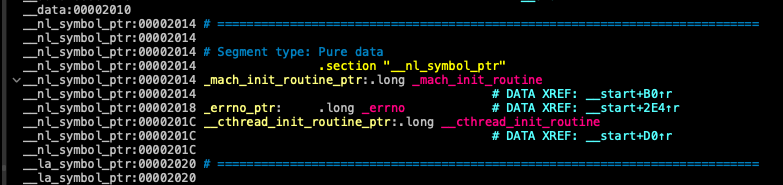
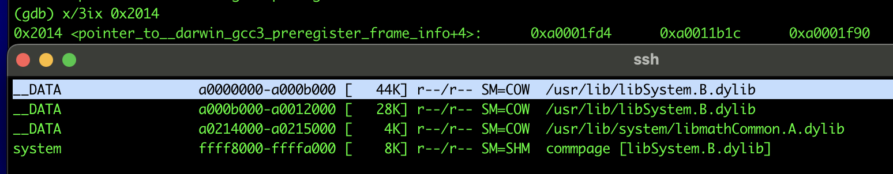
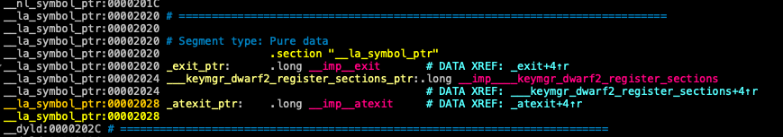
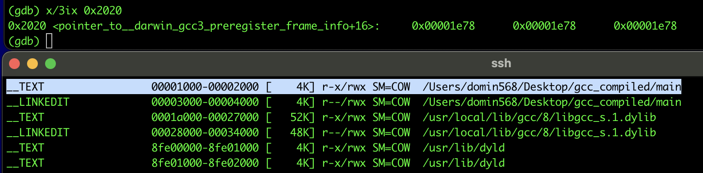

# OsxPpcEmu

Translation layer for PowerPC Mac OS X executables.

Project was instantiated to emulate Metrowerks CodeWarrior 9.0 for Mac OS X (PowerPC commandline program).
all API declarations are based on dyld 46.16 / Mac OS X 10.4 SDK.

Under the hood it uses Unicorn Engine (https://github.com/unicorn-engine/unicorn) for emulation. All API calls are
redirected and resolved by host.

At the moment it was tested only against Metrowerks CodeWarrior 9.0 for Mac OS X, CLI, mwpefcc, mwpefld on
arm64-apple-darwin25.1.0 host.
Other host platforms are not yet fully tested at the time. No GUI support. The project is in the early development
stage. 100% API coverage is not guaranteed.

Debug configuration has debugger (interactive or gdb server). Release just emulates the binary.

Project needs c++ 23 compiler (tested with apple clang-1700.6.4.2).

If emulator has unimplemented API call it could look like this in stdout

```bash
┌─ 0xf0000004 (unknown) <- 0x213c <- 0x199c <- 0x1900f
```

# Quick Start Guide

```bash
./OsxPpcEmu <ppc32 macho executable> [arguments]
```

## Choose Your Debugger Mode

### 1. Interactive Debugger (Default)

**When to use**: Quick debugging, command-line workflow, simple tasks, tracing API calls

### 2. GDB Server Mode (IDA Pro integration)

```bash
GDB_SERVER=1 ./OsxPpcEmu <binary> [arguments]
```

Then connect from IDA Pro: `Debugger → Attach → localhost:23946`

**When to use**: Complex analysis, visual debugging, reverse engineering

---

## Interactive Debugger Commands

| Command               | Description               | Example            |
|-----------------------|---------------------------|--------------------|
| `c`                   | Continue execution        | `c`                |
| `s` or `si`           | Step one instruction      | `s`                |
| `so`                  | Step out of function      | `so`               |
| `b <addr>`            | Set breakpoint            | `b 3620`           |
| `d <addr>`            | Delete breakpoint         | `d 3620`           |
| `l`                   | List breakpoints          | `l`                |
| `watch <addr> <size>` | Set memory watchpoint     | `watch bffeff40 4` |
| `unwatch <addr>`      | Remove watchpoint         | `unwatch bffeff40` |
| `lw`                  | List watchpoints          | `lw`               |
| `r`                   | Show registers            | `r`                |
| `wr <reg> <val>`      | Write value to register   | `wr r3 1234`       |
| `bt`                  | Show call stack           | `bt`               |
| `x <addr> <len>`      | Hexdump memory            | `x 1000 100`       |
| `w <addr> <bytes>`    | Write hex bytes to memory | `w 1000 deadbeef`  |
| `vmmap`               | Show memory regions       | `vmmap`            |
| `trace`               | Toggle API call tracing   | `trace`            |
| `h` or `?`            | Show help                 | `h`                |
| `q`                   | Quit                      | `q`                |

**Note**: Addresses and values are in hexadecimal (no 0x prefix needed)

**Note**: trace command dumps API calls to trace.txt file (except unknown API calls which are printed to console)

---

## Common Workflows

### 1. Quick API Flow Check

```bash
./OsxPpcEmu myapp
(dbg) c
# Watch console for API calls
```

### 2. Debug Specific Function

```bash
./OsxPpcEmu myapp
(dbg) b 3700       # Function address
(dbg) c            # Run to breakpoint
(dbg) r            # Check registers
(dbg) wr r3 1000   # Modify register
(dbg) s            # Step through
```

### 3. IDA Pro Analysis

```bash
GDB_SERVER=1 ./OsxPpcEmu myapp
# In IDA Pro:
# 1. Debugger → Attach → localhost:23946
# 2. Set breakpoints (F2)
# 3. Step through code (F7/F8)
```

---

## Environment Variables

| Variable     | Value        | Effect                   |
|--------------|--------------|--------------------------|
| `GDB_SERVER` | `1`          | Enable IDA Pro mode      |
| `GDB_SERVER` | `0` or unset | Use interactive debugger |

---

## Example Session

```bash
$ ./OsxPpcEmu mwpefcc

=== Interactive Debugger ===
Entry point: 0x3610

(dbg) b 3700
Breakpoint added at 0x3700

(dbg) c
Continuing...
┌─ _printf <- _main
│  arg0: 0x1234 ("Hello")
└─ return: 0x5

=== Breakpoint at 0x3700 ===
(dbg) r
PC  = 0x00003700
LR  = 0x00003650
R3  = 0x00001234
...

(dbg) bt
Call stack:
  #0  0x00003700 <_myfunction>
  #1  0x00003650 <_main>
  #2  0x000036a0 <__start>

(dbg) s
(dbg) s
(dbg) c
```

## Example API trace

```bash
┌─ _mach_init_routine <- 0x1960 <- 0x1900
└─ return: 0x1
┌─ __cthread_init_routine <- 0x197c <- 0x1900
└─ return: 0x1
┌─ ___keymgr_dwarf2_register_sections <- 0x1980 <- 0x1900
└─ return: 0x1
┌─ 0xf0000004 (unknown) <- 0x213c <- 0x199c <- 0x1900
┌─ 0xf0000004 (unknown) <- 0x217c <- 0x199c <- 0x1900
┌─ 0xf0000004 (unknown) <- 0x2188 <- 0x199c <- 0x1900
┌─ _dyld_func_lookup_ptr_in_dyld <- 0x1ba4 <- 0x19a0 <- 0x1900
│  arg0: 0x2bdc ("__dyld_make_delayed_module_initializer_calls")
│  arg1: 0xbffeff18
└─ return: 0x2bdc ("__dyld_make_delayed_module_initializer_calls")
┌─ __dyld_make_delayed_module_initializer_calls <- 0x1bb0 <- 0x19a0 <- 0x1900
└─ return: 0x2bdc ("__dyld_make_delayed_module_initializer_calls")
┌─ _dyld_func_lookup_ptr_in_dyld <- 0x1ca0 <- 0x19a4 <- 0x1900
│  arg0: 0x2c0c ("__dyld_image_count")
│  arg1: 0xbffefef8
└─ return: 0x2c0c ("__dyld_image_count")
┌─ _dyld_func_lookup_ptr_in_dyld <- 0x1cb0 <- 0x19a4 <- 0x1900
│  arg0: 0x2c20 ("__dyld_get_image_name")
│  arg1: 0xbffefefc
└─ return: 0x2c20 ("__dyld_get_image_name")
┌─ _dyld_func_lookup_ptr_in_dyld <- 0x1cc0 <- 0x19a4 <- 0x1900
│  arg0: 0x2c38 ("__dyld_get_image_header")
│  arg1: 0xbffeff00
└─ return: 0x2c38 ("__dyld_get_image_header")
┌─ _dyld_func_lookup_ptr_in_dyld <- 0x1cd0 <- 0x19a4 <- 0x1900
│  arg0: 0x2c50 ("__dyld_NSLookupSymbolInImage")
│  arg1: 0xbffeff04
└─ return: 0x2c50 ("__dyld_NSLookupSymbolInImage")
┌─ _dyld_func_lookup_ptr_in_dyld <- 0x1ce0 <- 0x19a4 <- 0x1900
│  arg0: 0x2c70 ("__dyld_NSAddressOfSymbol")
│  arg1: 0xbffeff08
└─ return: 0x2c70 ("__dyld_NSAddressOfSymbol")
┌─ _dyld_func_lookup_ptr_in_dyld <- 0x19b4 <- 0x1900
│  arg0: 0x2bc4 ("__dyld_mod_term_funcs")
│  arg1: 0xbffeff78
└─ return: 0x2bc4 ("__dyld_mod_term_funcs")
┌─ _setlocale <- 0x2224 <- 0x1a5c <- 0x1900
│  arg0: 0x0
│  arg1: 0x2bc0
└─ return: 0x10000c80 ("C.UTF-8")
┌─ 0xf0000004 (unknown) <- 0x23e4 <- 0x1a5c <- 0x1900
┌─ _fwrite <- 0x23c8 <- 0x1a5c <- 0x1900
│  arg0: 0x2d8c
│  arg1: 0x1
│  arg2: 0x25
│  arg3: 0xf0000168
└─ return: 0x25
┌─ _exit <- 0x24a8 <- 0x1a5c <- 0x1900
│  arg0: 0x1
└─ return: 0x1

```

---

# Dyld notes

Almost each executable in Darwin (OSX) is linked dynamically, that means all needed functions are linked during binary
load.
On Mac OS X (10.4) when MachO is executed, kernel (xnu/bsd/kern/mach_loader.c):

- maps segments (LC_COMMAND),
- sets entry point (LC_UNIXTHREAD)
- load dynamic linker (pointed by LC_LOAD_DYLINKER) and let it do the rest of the job (in userland)
  MachO executables (MH_EXECUTE) does not need to relocated.

Then kernel redirects execution to __dyld_start (dyldStartup.s) (each arch has its own asm snippet). It takes care of:

- mapping and relocating dynamic libraries (MH_DYLIB) recursively (LC_LOAD_DYLIB, LC_DYSYMTAB)
- calling init functions from libraries (LC_ROUTINES)

Then redirects execution to loaded MachO executable entry point.

Imported symbols pointers are in

- __nl_symbol_ptr section (non lazy symbols)
- __la_symbol_ptr section (lazy symbols)


For non lazy symbols, dyld loads them during load so when executable is loaded, all pointers are filled with actual
adresses (function/pointers etc.)


As it turns out these 3 symbols addresses are pointers in DATA segment in libsystem.B.dylib (checked using vmmap).


For lazy symbols, dyld loads them during runtime when first call is encountered.


3 lazy symbols at 0x2020 points to the same address (in main executable TEXT segment).
That's the dyld_stub_binding_helper that calls _stub_binding_helper in dyld (0x8FE01000, address is hardcoded in
binary (no ASLR at that time yet), that's the specific address for dyld)
and it leads to call uintptr_t dyld::bindLazySymbol(const mach_header* mh, uintptr_t* lazyPointer)

dyld parses LC_LOAD_DYLIB load command to get to know which dylib load
then it uses info from LC_DYSYMTAB.

- Local Symbols (index in LC_SYMTAB and count of local symbols in the symbol table LC_SYMTAB)
- External Defined Symbols (index in LC_SYMTAB and count of symbols that are exported, i.e. other dylibs/executables can
  link against them)
- Undefined External Symbols (index in LC_SYMTAB and count of symbols that needs to be imported from other
  binaries/dylibs)
- Table of Contents (offset in file and count, used in archive libraries (.a) only)
- Module Table (offset in file and count, used in static libraries to group symbols by object file, 0 for normal
  executables)
- External Reference Symbols (offset in file and count, used in archives/static linking)
- Indirect Symbol Table (offset in file to indirect symbol table and how many entries it has)
  When you call a function from another dylib, your code doesn't call it directly, it calls a stub that jumps through
  and indirect symbol table entry
- External Relocation Entries (offset and count, often 0 because dyld handles binding through stubs instead)
- Local Relocation Entries (offset and count, used for relocations that apply only within local/launched executable)

### References:

- MacOS and iOS Internals, Volume 1 User Mode, Jonathan Levin
- Mac OS X Internals: A Systems Approach, Amit Singh