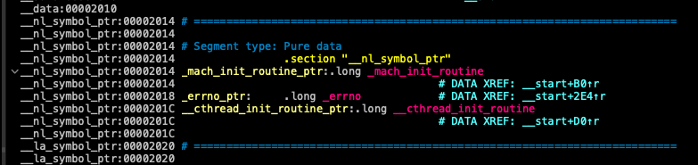
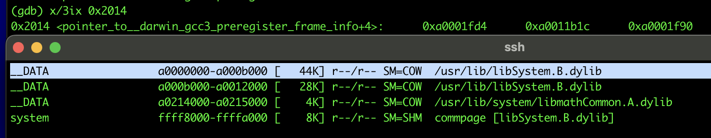
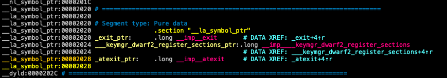
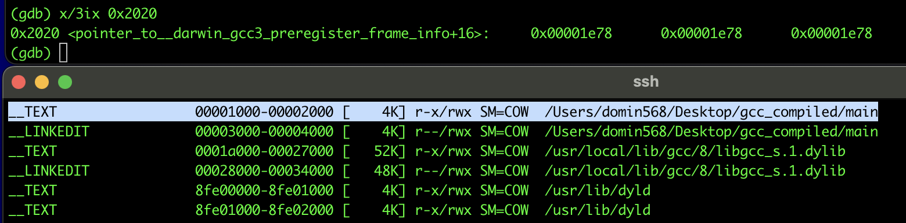

# OsxPpcEmu

Translation layer for PowerPC Mac OS X executables.

Project was instantiated to emulate Metrowerks CodeWarrior 9.0 for Mac OS X (PowerPC commandline program). all API
declarations are based on dyld 46.16 / Mac OS X 10.4 SDK.

Under the hood it uses Unicorn Engine (https://github.com/unicorn-engine/unicorn) for emulation. All API calls are
redirected and resolved by host.

Debug configuration has debugger (interactive or gdb server). Release just emulates the binary.

If emulator has unimplemented API call it could look like this in stdout (in Debug build)

```bash
┌─ 0xf0000004 (unknown) <- 0x213c <- 0x199c <- 0x1900f
```

## Building the Project

Requires CMake and a C++23 compiler. The project is configured through
[CMake presets](CMakePresets.json). Dependencies are managed with [vcpkg](https://github.com/microsoft/vcpkg).

```bash
git clone https://github.com/domin568/OsxPpcEmu.git
cd OsxPpcEmu
```

### Installing vcpkg

```bash
git clone https://github.com/microsoft/vcpkg.git ~/vcpkg
~/vcpkg/bootstrap-vcpkg.sh      # macOS / Linux
# ~/vcpkg/bootstrap-vcpkg.bat   # Windows
```

Dependencies from [`vcpkg.json`](vcpkg.json) are installed automatically on first configure.

### Configuring, Building and Testing

```bash
cmake --preset <preset-name>
cmake --build build/<preset-name>
ctest --test-dir build/<preset-name> --output-on-failure
```

Preset names follow the pattern `<platform>-<config>[-debugger]`, where:

- `<platform>` selects the OS, architecture and compiler/toolchain. Presets default to the Ninja generator wherever
  possible (MSVC presets use the Visual Studio generator instead):

  | Platform          | OS      | Arch  | Compiler / Generator                    |
          |-------------------|---------|-------|------------------------------------------|
  | `win-x64-mingw`   | Windows | x64   | MinGW g++ (Ninja)                        |
  | `win-x64-msvc`    | Windows | x64   | MSVC (Visual Studio 18 2026)              |
  | `win-arm64-msvc`  | Windows | arm64 | MSVC (Visual Studio 18 2026)              |
  | `win-x64-clang`   | Windows | x64   | clang++ (Ninja)                          |
  | `mac-x64`         | macOS   | x64   | AppleClang (Ninja)                       |
  | `mac-arm64`       | macOS   | arm64 | AppleClang (Ninja)                       |
  | `lin-x64-gcc`     | Linux   | x64   | g++ (Ninja)                              |
  | `lin-x64-clang`   | Linux   | x64   | clang++ (Ninja)                          |
  | `lin-arm64-gcc`   | Linux   | arm64 | g++ (Ninja)                              |
  | `lin-arm64-clang` | Linux   | arm64 | clang++ (Ninja)                          |

- `<config>` is either `release` (`CMAKE_BUILD_TYPE=Release`) or `debug` (`CMAKE_BUILD_TYPE=Debug`).
- an optional trailing `-debugger` suffix additionally sets `ENABLE_DEBUGGER=ON`, compiling in the interactive/GDB
  debugger support described below.

For example:

```bash
cmake --preset lin-x64-gcc-debug-debugger
cmake --build build/lin-x64-gcc-debug-debugger -j$(nproc)
ctest --test-dir build/lin-x64-gcc-debug-debugger --output-on-failure
```

Every platform has 4 presets (`release`, `debug`, `release-debugger`, `debug-debugger`), giving 40 presets in total.
Binary output for each preset lands in its own `build/<preset-name>` directory.

# Quick Start Guide

```bash
./OsxPpcEmu [--heap-mode=bump|quarantine|real] <ppc32 macho executable> [arguments]
```

## Heap Modes

The guest heap allocator supports three selectable free () policies, chosen via
`--heap-mode=<mode>` (must appear before the target executable path) or the
`OSXPPCEMU_HEAP_MODE` environment variable (the CLI flag takes precedence). Default: `quarantine`.

| Mode         | Behaviour                                                              | When to use                                                                                                                                                                                           |
|--------------|------------------------------------------------------------------------|-------------------------------------------------------------------------------------------------------------------------------------------------------------------------------------------------------|
| `bump`       | `free()` retires the chunk permanently (poisoned, never reused).       | Bisecting a regression: if a sample only misbehaves under a real allocator, running it in `bump` proves whether chunk reuse is the cause.                                                             |
| `quarantine` | `free()` poisons and holds the chunk in a FIFO before allowing reuse.  | Default. Best chance of catching use-after-free bugs (in the emulated binary or in our own shims) at the cost of ~4 MiB held-back memory and deferred coalescing.                                     |
| `real`       | `free()` coalesces and returns the chunk to the free bins immediately. | Highest fidelity to a real `malloc`; use when a sample's behaviour depends on immediate chunk reuse, or for throughput-oriented batch runs where the quarantine's memory/CPU overhead isn't worth it. |

```bash
./OsxPpcEmu --heap-mode=bump myapp
OSXPPCEMU_HEAP_MODE=real ./OsxPpcEmu myapp
```

## Choose Your Debugger Mode

### 1. Interactive Debugger (Default)

**When to use**: Quick debugging, command-line workflow, simple tasks, tracing API calls

### 2. GDB Server Mode (IDA Pro integration)

```bash
GDB_SERVER=1 ./OsxPpcEmu <binary> [arguments]
```

Then connect from IDA Pro: `Debugger → Attach → localhost:23946`

**When to use**: Complex analysis, visual debugging, reverse engineering

---

## Interactive Debugger Commands

| Command               | Description                                   | Example              |
|-----------------------|-----------------------------------------------|----------------------|
| `c`                   | Continue execution                            | `c`                  |
| `s` or `si`           | Step one instruction                          | `s`                  |
| `so`                  | Step out of function                          | `so`                 |
| `b <addr>`            | Set breakpoint                                | `b 3620`             |
| `d <addr>`            | Delete breakpoint                             | `d 3620`             |
| `l`                   | List breakpoints                              | `l`                  |
| `watch <addr> <size>` | Set memory watchpoint                         | `watch bffeff40 4`   |
| `unwatch <addr>`      | Remove watchpoint                             | `unwatch bffeff40`   |
| `lw`                  | List watchpoints                              | `lw`                 |
| `r`                   | Show registers                                | `r`                  |
| `wr <reg> <val>`      | Write value to register                       | `wr r3 1234`         |
| `bt`                  | Show call stack                               | `bt`                 |
| `x <addr> <len>`      | Hexdump memory                                | `x 1000 100`         |
| `w <addr> <bytes>`    | Write hex bytes to memory                     | `w 1000 deadbeef`    |
| `vmmap`               | Show memory regions                           | `vmmap`              |
| `heap`                | Heap summary (mode, committed, in use, stats) | `heap`               |
| `heap chunks [n]`     | Walk heap chunks (default 64, 0 = all)        | `heap chunks 20`     |
| `heap find <addr>`    | Which chunk owns `<addr>`                     | `heap find 10001234` |
| `heap bins`           | Free-list bin occupancy                       | `heap bins`          |
| `heap check`          | Validate heap integrity                       | `heap check`         |
| `heap quarantine`     | List quarantined (recently freed) chunks      | `heap quarantine`    |
| `trace`               | Toggle API call tracing                       | `trace`              |
| `h` or `?`            | Show help                                     | `h`                  |
| `q`                   | Quit                                          | `q`                  |

**Note**: Addresses and values are in hexadecimal (no 0x prefix needed)

**Note**: trace command dumps API calls to trace.txt file (except unknown API calls which are printed to console)

---

## Common Workflows

### 1. Quick API Flow Check

```bash
./OsxPpcEmu myapp
(dbg) c
# Watch console for API calls
```

### 2. Debug Specific Function

```bash
./OsxPpcEmu myapp
(dbg) b 3700       # Function address
(dbg) c            # Run to breakpoint
(dbg) r            # Check registers
(dbg) wr r3 1000   # Modify register
(dbg) s            # Step through
```

### 3. IDA Pro Analysis

```bash
GDB_SERVER=1 ./OsxPpcEmu myapp
# In IDA Pro:
# 1. Debugger → Attach → localhost:23946
# 2. Set breakpoints (F2)
# 3. Step through code (F7/F8)
```

---

## Environment Variables

| Variable     | Value        | Effect                   |
|--------------|--------------|--------------------------|
| `GDB_SERVER` | `1`          | Enable IDA Pro mode      |
| `GDB_SERVER` | `0` or unset | Use interactive debugger |

---

## Example Session

```bash
$ ./OsxPpcEmu mwpefcc

=== Interactive Debugger ===
Entry point: 0x3610

(dbg) b 3700
Breakpoint added at 0x3700

(dbg) c
Continuing...
┌─ _printf <- _main
│  arg0: 0x1234 ("Hello")
└─ return: 0x5

=== Breakpoint at 0x3700 ===
(dbg) r
PC  = 0x00003700
LR  = 0x00003650
R3  = 0x00001234
...

(dbg) bt
Call stack:
  #0  0x00003700 <_myfunction>
  #1  0x00003650 <_main>
  #2  0x000036a0 <__start>

(dbg) s
(dbg) s
(dbg) c
```

## Example API trace

```bash
┌─ _mach_init_routine <- 0x1960 <- 0x1900
└─ return: 0x1
┌─ __cthread_init_routine <- 0x197c <- 0x1900
└─ return: 0x1
┌─ ___keymgr_dwarf2_register_sections <- 0x1980 <- 0x1900
└─ return: 0x1
┌─ 0xf0000004 (unknown) <- 0x213c <- 0x199c <- 0x1900
┌─ 0xf0000004 (unknown) <- 0x217c <- 0x199c <- 0x1900
┌─ 0xf0000004 (unknown) <- 0x2188 <- 0x199c <- 0x1900
┌─ _dyld_func_lookup_ptr_in_dyld <- 0x1ba4 <- 0x19a0 <- 0x1900
│  arg0: 0x2bdc ("__dyld_make_delayed_module_initializer_calls")
│  arg1: 0xbffeff18
└─ return: 0x2bdc ("__dyld_make_delayed_module_initializer_calls")
┌─ __dyld_make_delayed_module_initializer_calls <- 0x1bb0 <- 0x19a0 <- 0x1900
└─ return: 0x2bdc ("__dyld_make_delayed_module_initializer_calls")
┌─ _dyld_func_lookup_ptr_in_dyld <- 0x1ca0 <- 0x19a4 <- 0x1900
│  arg0: 0x2c0c ("__dyld_image_count")
│  arg1: 0xbffefef8
└─ return: 0x2c0c ("__dyld_image_count")
┌─ _dyld_func_lookup_ptr_in_dyld <- 0x1cb0 <- 0x19a4 <- 0x1900
│  arg0: 0x2c20 ("__dyld_get_image_name")
│  arg1: 0xbffefefc
└─ return: 0x2c20 ("__dyld_get_image_name")
┌─ _dyld_func_lookup_ptr_in_dyld <- 0x1cc0 <- 0x19a4 <- 0x1900
│  arg0: 0x2c38 ("__dyld_get_image_header")
│  arg1: 0xbffeff00
└─ return: 0x2c38 ("__dyld_get_image_header")
┌─ _dyld_func_lookup_ptr_in_dyld <- 0x1cd0 <- 0x19a4 <- 0x1900
│  arg0: 0x2c50 ("__dyld_NSLookupSymbolInImage")
│  arg1: 0xbffeff04
└─ return: 0x2c50 ("__dyld_NSLookupSymbolInImage")
┌─ _dyld_func_lookup_ptr_in_dyld <- 0x1ce0 <- 0x19a4 <- 0x1900
│  arg0: 0x2c70 ("__dyld_NSAddressOfSymbol")
│  arg1: 0xbffeff08
└─ return: 0x2c70 ("__dyld_NSAddressOfSymbol")
┌─ _dyld_func_lookup_ptr_in_dyld <- 0x19b4 <- 0x1900
│  arg0: 0x2bc4 ("__dyld_mod_term_funcs")
│  arg1: 0xbffeff78
└─ return: 0x2bc4 ("__dyld_mod_term_funcs")
┌─ _setlocale <- 0x2224 <- 0x1a5c <- 0x1900
│  arg0: 0x0
│  arg1: 0x2bc0
└─ return: 0x10000c80 ("C.UTF-8")
┌─ 0xf0000004 (unknown) <- 0x23e4 <- 0x1a5c <- 0x1900
┌─ _fwrite <- 0x23c8 <- 0x1a5c <- 0x1900
│  arg0: 0x2d8c
│  arg1: 0x1
│  arg2: 0x25
│  arg3: 0xf0000168
└─ return: 0x25
┌─ _exit <- 0x24a8 <- 0x1a5c <- 0x1900
│  arg0: 0x1
└─ return: 0x1

```

---

# Dyld notes

Almost each executable in Darwin (OSX) is linked dynamically, that means all needed functions are linked during binary
load. On Mac OS X (10.4) when MachO is executed, kernel (xnu/bsd/kern/mach_loader.c):

- maps segments (LC_COMMAND),
- sets entry point (LC_UNIXTHREAD)
- load dynamic linker (pointed by LC_LOAD_DYLINKER) and let it do the rest of the job (in userland)
  MachO executables (MH_EXECUTE) does not need to relocated.

Then kernel redirects execution to __dyld_start (dyldStartup.s) (each arch has its own asm snippet). It takes care of:

- mapping and relocating dynamic libraries (MH_DYLIB) recursively (LC_LOAD_DYLIB, LC_DYSYMTAB)
- calling init functions from libraries (LC_ROUTINES)

Then redirects execution to loaded MachO executable entry point.

Imported symbols pointers are in

- __nl_symbol_ptr section (non lazy symbols)
- __la_symbol_ptr section (lazy symbols)


For non lazy symbols, dyld loads them during load so when executable is loaded, all pointers are filled with actual
adresses (function/pointers etc.)


As it turns out these 3 symbols addresses are pointers in DATA segment in libsystem.B.dylib (checked using vmmap).


For lazy symbols, dyld loads them during runtime when first call is encountered.


3 lazy symbols at 0x2020 points to the same address (in main executable TEXT segment). That's the
dyld_stub_binding_helper that calls _stub_binding_helper in dyld (0x8FE01000, address is hardcoded in binary (no ASLR at
that time yet), that's the specific address for dyld)
and it leads to call uintptr_t dyld::bindLazySymbol (const mach_header* mh, uintptr_t* lazyPointer)

dyld parses LC_LOAD_DYLIB load command to get to know which dylib load then it uses info from LC_DYSYMTAB.

- Local Symbols (index in LC_SYMTAB and count of local symbols in the symbol table LC_SYMTAB)
- External Defined Symbols (index in LC_SYMTAB and count of symbols that are exported, i.e. other dylibs/executables can
  link against them)
- Undefined External Symbols (index in LC_SYMTAB and count of symbols that needs to be imported from other
  binaries/dylibs)
- Table of Contents (offset in file and count, used in archive libraries (.a) only)
- Module Table (offset in file and count, used in static libraries to group symbols by object file, 0 for normal
  executables)
- External Reference Symbols (offset in file and count, used in archives/static linking)
- Indirect Symbol Table (offset in file to indirect symbol table and how many entries it has)
  When you call a function from another dylib, your code doesn't call it directly, it calls a stub that jumps through
  and indirect symbol table entry
- External Relocation Entries (offset and count, often 0 because dyld handles binding through stubs instead)
- Local Relocation Entries (offset and count, used for relocations that apply only within local/launched executable)

### References:

- MacOS and iOS Internals, Volume 1 User Mode, Jonathan Levin
- Mac OS X Internals: A Systems Approach, Amit Singh

## Third party

- `third_party/printf` — Marco Paland's tiny printf/sprintf/snprintf, MIT license.
- `third_party/scanf` — FreeBSD libc `vfscanf`, stripped to a string-only, non-locale, non-wide-char `vsscanf_`,
  BSD-3-Clause license.

